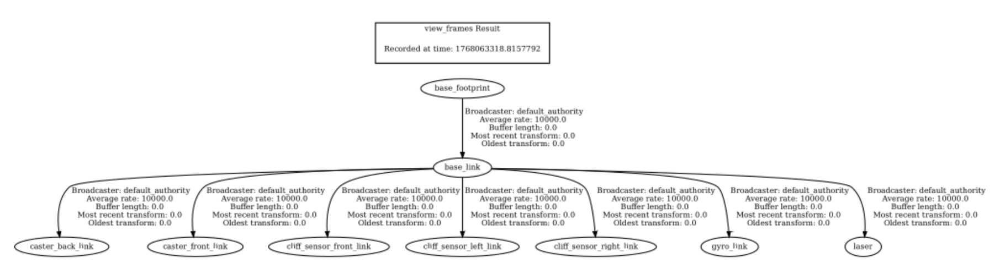
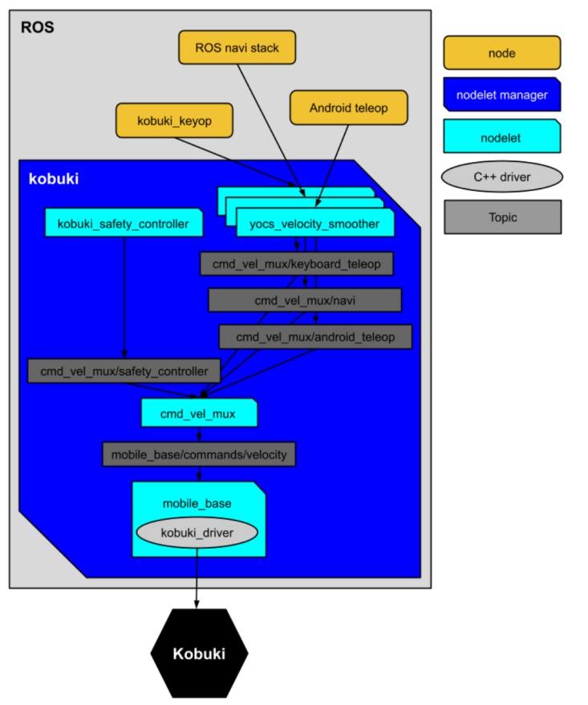

<!---
title: "Yujin Kobuki ROS2 setup documentation"
author: "Ugnius Stašaitis\nugnius@dev.stasaitis.me"
date: "2026-01-10"
toc: true
geometry: margin=1in
--->


## Short description
This document covers installing and setting up ROS2 on a RaspberryPI
(the Kobuki robot) and a more powerful desktop PC/VM/Distrobox machine.
It also covers acquiring, compiling and configuring ROS2 packages for
the Kobuki which allow the robot to be teleoperated and/or controlled via a
lidar-powered navigation stack.

## 1. Setting up the base system(s)

### 1. Installing Ubuntu.
Since this guide is using ROS Jazzy, you will need to install `Ubuntu 24.04.3 LTS (Noble)`.
#### 1. On the Kobuki
1. Download [`RaspberryPi Imager`](https://www.raspberrypi.com/software/)
2. Select `The Ubuntu server LTS 64-bit` image.
3. Use the
  [***super secret menu***](https://www.clustered-pi.com/blog/raspberry-pi-imager-secret-menu.html)
  to configure the WIFI and SSH access.
4. Flash the image
5. Insert the SD card into the PI and power it up!

  **A note on SSH:**
      I highly recommend using SSH to configure the RaspberryPI you'll be using to
      control the Kobuki.
      If you're not famillilar with SSH and how to set it up, a useful article can be
      found [here](https://www.digitalocean.com/community/tutorials/ssh-essentials-working-with-ssh-servers-clients-and-keys).

#### 2. Setting up another machine
You will need another machine for ROS capabilities which the RaspberryPI is not
powerful enough to properly run (eg.: Rviz2, compiling heavy ROS packages)

You have 4 options for this (ordered from simplest and easiest to hardest and most advanced):

1. If you have a spare machine, you can simply install Ubuntu on it.
2. You can install Ubuntu on a spare partition and dual-boot.

3. Set up a virtual machine (*this is the method I used*)
  - If you're running Linux, I recommend using
    [`Virtual Machine Manager`](https://virt-manager.org/).
  - If you're running Windows - there's
    [`VirtualBox`](https://www.virtualbox.org/).

  In either case, you will need to set up bridged networking on the VM in order
  for the VM to be able to communicate with the RaspberryPI. This process is
  moderately complex on Linux and I cannot comment how easy/hard it is to do
  on Windows.

4. Using containers
  - You can run [`ROS on Docker`](https://blog.robotair.io/the-complete-beginners-guide-to-using-docker-for-ros-2-deployment-2025-edition-0f259ca8b378). *Note: this works really well, but needs a lot of setup.*
  - If you're running Linux, [`Distrobox`](https://distrobox.it/)
  can let you run a containerized Ubuntu instance on your distro of choice.
  - If you're running Windows, you can experiment using the Windows Subsystem
  for Linux, but I have no idea how well it will work for this use case.


## 2. Installing ROS2

### 1. On the Kobuki:

```
wget https://raw.githubusercontent.com/kobuki-ktu/utils/master/install_ros2_kobuki.sh
bash install_ros2_kobuki.sh
```

### 2. On the Desktop

```
wget https://raw.githubusercontent.com/kobuki-ktu/utils/master/install_ros2_desktop.sh
bash install_ros2_desktop.sh
```

## 3. Testing the base ROS2 installation and communication
Ensure both machines are connected to the same network.

On the Kobuki run:

```
ros2 run demo_nodes_cpp talker
```

On the Desktop run:

```
ros2 run demo_nodes_cpp listener
```

If everything is set up and working correctly, you will see the Kobuki
transmitting "Hello World" messages and the Desktop machine succesfully
receiving them.

## 4. Installing the Kobuki packages on ROS2

Install a `udev` rule for the Kobuki, so it always appears as `/dev/kobuki` when
connected to the RaspberryPI (instead of `/dev/ttyUSBx`).
```
wget https://raw.githubusercontent.com/kobuki-ktu/kobuki_ftdi/devel/60-kobuki.rules
sudo cp 60-kobuki.rules /etc/udev/rules.d
sudo service udev reload
sudo service udev restart
```

The Kobuki ROS packages are not available on the ROS Jazzy repos, as such, we
will have to build them from source.

The packages depend on ECL, however, a few of the required ones are/were
unavailable on the ROS jazzy repos, so we must also build them from source.

The Kobuki and ECL source code is available on my GitHub fork.
The fork also has a few patches applied, since the original ECL code
needs a few small fixes in order to compile on current C++ compilers.
```
mkdir -p ~/kobuki/src
cd ~/kobuki

git clone https://github.com/kobuki-ktu/ecl_lite.git ~/kobuki/src/ecl_lite
git clone https://github.com/kobuki-ktu/ecl_core.git ~/kobuki/src/ecl_core

# ECL dependencies
sudo apt install -y ros-jazzy-angles
sudo apt install -y ros-jazzy-diagnostic-updater
sudo apt install -y ros-jazzy-ecl-build
sudo apt install -y ros-jazzy-sophus

colcon build
```

**TIP:** If a package fails to build, you can try to build the packages by groups:

`colcon build --packages-select-regex ecl`

Or even one by one:

`colcon build --packages-select-regex ecl_time`

If ECL was compiled succesfully, we can now compile the Kobuki packages:
```
mkdir -p ~/kobuki/src
cd ~/kobuki

git clone https://github.com/kobuki-ktu/kobuki_core.git \
    ~/kobuki/src/kobuki_core
git clone https://github.com/kobuki-ktu/kobuki_ros_interfaces.git \
    ~/kobuki/src/kobuki_ros_interfaces
git clone https://github.com/kobuki-ktu/kobuki_ros.git \
    ~/kobuki/src/kobuki_ros
git clone https://github.com/kobuki-ktu/kobuki_velocity_smoother.git \
    ~/kobuki/src/kobuki_velocity_smoother

colcon build
```

After installing the packages, you will need to activate your ROS2 overlay
(environment) each time you want to use these packages:
```
source ~/kobuki/install/setup.bash
```
**TIP**: Add this command to your [`.bashrc`](https://www.digitalocean.com/community/tutorials/bashrc-file-in-linux)

If everything built correctly, try connecting the Kobuki to the RaspberryPI and
running this command:
```
kobuki-simple-keyop
```
You should be able to control the robot via keyboard input

*Note: this is only testing the base Kobuki driver, which is communicating
with the robot directly - not through ROS2*

## 5. Note on launch files for the Kobuki packages

As the Kobuki project is no longer maintained,
many of the original launch files for the Kobuki ROS2 nodes need small to
moderate ammounts of fixup in order to work properly. As such, commands like:
```
ros2 launch kobuki_random_walker kobuki_random_walker_app.launch
```
are not going to work directly since they're using the original launch files

If you'll want to build more complex behaviour, you'll also need to edit the
launch files in order to configure packages and connect them together.

***You should always make a copy of the launch files instead of editing them
directly***

In every single ROS package you compiled via `colcon`, the launch files will
be located in
```
~/kobuki/install/<package_name>/share/<package_name>/launch
```

In every single ROS package you install via `apt install`, the launch files will
be located in
```
/opt/ros/jazzy/share/<package_name>/launch
```

## 6. Configuring keyboard control via ROS2

Keyboard control via ROS2 will require you to install a package for sending
keyboard commands to ROS2.

```
sudo apt install -y ros-jazzy-teleop-twist-keyboard
```

The next steps will require you to launch multiple terminals or use `tmux`

In one terminal run:
```
ros2 launch kobuki_node kobuki_node-launch.py
```
This connects the Kobuki driver to ROS and exposes various ROS topics for
controlling the robot and getting information out of it.

You can see these topics by running this command in another terminal
```
ros2 topic list
```
**Note:** the `kobuki_node` must be running for you to see the topic list.

The output will look something like this:
```
<...>
/commands/controller_info
/commands/digital_output
/commands/external_power
/commands/led1
/commands/led2
/commands/motor_power
/commands/reset_odometry
/commands/sound
/commands/velocity
/controller_info
/debug/raw_control_command
/debug/raw_data_command
/debug/raw_data_stream
/diagnostics
/events/bumper
/events/button
/events/cliff
/events/digital_input
/events/power_system
/events/robot_state
/events/wheel_drop
<...>

```

We are interested in the `/commands/velocity` topic if we want to move the robot.

If you run
```
ros2 topic info /commands/velocity
```

You will see the type of ROS messages it accepts, the number of ROS nodes
which are publishing to it, and the number of nodes which are subscribed to it.

```
Type: geometry_msgs/msg/Twist
Publisher count: 0
Subscription count: 1
```

In this case the subscriber is the `kobuki_node` which is listening for
`geometry_msgs/msg/Twist` messages.

Lets send some of these messages!


This command runs another ROS node which will send messages
to `/commands/velocity` (launch it in another terminal)
```
ros2 run teleop_twist_keyboard teleop_twist_keyboard \
--ros-args --remap cmd_vel:=/commands/velocity

```

**Note:**
We use the `--remap cmd_vel:=/commands/velocity` because by default this
package outputs messages to the `/cmd_vel` topic, but the Kobuki is
listening on `/commands/velocity`. This redirects the messages to the correct
destination. It would also be valid to remap the kobuki_node's input from
`/commands/velocity` to `/cmd_vel` - it would also serve the same purpose.

Once you've launched the keyboard node, try moving the robot.

You can observe what values the are sent to `/commands/velocity` by calling this
command in another terminal.
```
ros2 topic echo /commands/velocity
```

If you're using the recommended 2 machine setup and the other machine is
connected to the same network as the Kobuki and ROS2 is installed correctly,
you can control the Robot from the other machine!

Simply run ONLY the `kobuki_node` on the Kobuki, and
ONLY the `teleop_twist_node` on the other machine.

## 7. Setting up LIDAR, SLAM and using RVIZ

To enable autonomous mapping and navigation on the Kobuki, we will first need
to set up LIDAR and SLAM.

In the setup I used, I had the `rpi-lidar A1`. Your milleage may vary using
other models.

### 1. Package install

For this we are going to use 2 packages:

`rpilidar_ros` and `slam_toolbox`

`slam toolbox` can be simply installed via:
```
sudo apt install -y ros-jazzy-slam-toolbox
```

`rpi-lidar`, however, will have to be compiled from source:
```
git clone https://github.com/kobuki-ktu/rplidar_ros2.git ~/kobuki/src/rpilidar_ros2

`colcon build --packages-select-regex rpilidar`
```

### 2. Robot state publisher

Before we can launch anythinhg, we must launch a very important node which is
named the `robot_state publisher`. The puprose of this node is to set up transformations
between various local/global coordinate reference frames. These transforms basically describe
where everything is located in relation to each other physically on the robot.
Many ROS packages rely on this information to function properly.

In order to launcn the `robot_state_publisher` we must first create a launch file:
```
from launch import LaunchDescription
from launch.actions import DeclareLaunchArgument
from launch.conditions import IfCondition, UnlessCondition
from launch.substitutions import Command, LaunchConfiguration
from launch_ros.actions import Node
from launch_ros.substitutions import FindPackageShare
import os

def generate_launch_description():
    pkg_share = FindPackageShare(package='kobuki_description').find('kobuki_description')
    default_model_path = os.path.join(pkg_share, 'urdf', 'kobuki_standalone.urdf.xacro')

    robot_state_publisher_node = Node(
        package='robot_state_publisher',
        executable='robot_state_publisher',
        parameters=[{'robot_description': Command(['xacro ', LaunchConfiguration('model')])}]
    )
    return LaunchDescription([
        DeclareLaunchArgument(name='model', default_value=default_model_path,
        description='Absolute path to robot model file'),
        robot_state_publisher_node,
    ])
```

The important thing to note here is the `default_model_path` which is set to the
Kobuki's URDF file. This file contains the actual description of the robot, from
which the transformations mentioned above are automatically generated.
You can read more about
URDF [here](https://articulatedrobotics.xyz/tutorials/ready-for-ros/urdf/).

Before you launch the file you must also install the `xacro` tool:
```
sudo apt install -y ros-jazzy-xacro
```

Once you save the above file to disk, you can launch it like this:
```
ros2 launch robot_state_publisher.py.launch
```
(In this case the file was saved under the name `robot_state_publisher.py.launch`)

### 3. Linking the lidar

The provided URDF file only provides transforms for the base components of the
robot. Since we're adding a LIDAR module, ROS also expects it to be linked
via transforms to the physical robot.

To to this, we add a manual transform, which sets the location of the lidar module's
coordinate reference frame to be inside the robot.
```
ros2 run tf2_ros static_transform_publisher 0 0 0 0 0 0 base_link laser
```

This links the `laser` frame to the `base_link` frame.

You can view the entire transform tree by running
```
ros2 run tf2_tools view_frames
```
This generates a pdf with a view of all the transforms. Your transform tree
should look like this if you set everything up correctly:




### 4. Launching the nodes

If everything was compiled, installed and configured successfuly, we can try
and launch the nodes:

The LIDAR node can be launched via:
```
ros2 launch rplidar_ros rplidar.launch.py
```
It publishes data to the `/scan` topic.

**Note:** the Rpilidar package and/or A1 module can be flaky and crash while starting.
You may try to plug the LIDAR module into another USB port on the PI if this happens.

To launch `slam_toolbox` run:
```
ros2 launch slam_toolbox online_sync_launch.py
```

### 5. Using Rviz2

[Guide on Rviz2 usage](https://docs.ros.org/en/jazzy/Tutorials/Intermediate/RViz/RViz-User-Guide/RViz-User-Guide.html)

To see the map which is generated by SLAM, you only need to add the `map`
`display type` to Rviz.

You can also add the `RobotModel` display type to see a 3D model of the Kobuki's
current location on the map. However, this requires you to have the Kobuki packages
installed on the machine you are running Rviz2 on.

Try moving the robot arround and you should see the map update.

If you want the mapping to be more responsive you can find `slam_toolbox`'s
launch config file and tune these fields:

- minimum_travel_distance
- minimum_travel_heading
- minimum_time_interval


## 8. Smoothing and muxing inputs

Before we do autonomous navigation it would be a good idea to give ourselves
a manual control override if the robot tries to do anything stupid.

This can be achieved using the `cmd_vel_mux` package.

It is also a good a idea to smooth all the inputs so the robot doesn`t jerk
during acceleration or braking and doesn't cause damage to itself.

This can be achieved using the `kobuki_velocity_smoother` package.

The Kobuki's control diagram:


### 1. Cmd_vel_mux setup

This is the launch file for the `cmd_vel_mux` package.
(Set the params_file path according to your setup)
```
import os

import ament_index_python.packages
import launch
import launch_ros.actions

import yaml


def generate_launch_description():
    share_dir =
        ament_index_python.packages.get_package_share_directory('cmd_vel_mux')
    params_file = '/home/pi/launch/kobuki/velocity_mux/cmd_vel_mux_params.yaml'
    with open(params_file, 'r') as f:
        params = yaml.safe_load(f)['cmd_vel_mux']['ros__parameters']

    cmd_vel_mux_node = launch_ros.actions.Node(
        package='cmd_vel_mux',
        executable='cmd_vel_mux_node',
        output='both',
        parameters=[params]
    )

    return launch.LaunchDescription([cmd_vel_mux_node])

```

This is the params file for 3 different input sources (topics):
```
cmd_vel_mux:
  ros__parameters:
    subscribers:
        navigation_stack:
          topic:       "cmd_vel_mux/navigation"
          timeout:     1.0
          priority:    1
          short_desc:  "Navigation stack controller"
        joystick:
          topic:       "cmd_vel_mux/joystick"
          timeout:     0.1
          priority:    10
          short_desc:  "Keyboard operation"
        keyboard_operation:
          topic:       "cmd_vel_mux/keyop"
          timeout:     0.1
          priority:    20
          short_desc:  "Keyboard operation"

```

### 2. Velocity smoother setup

This is the launch file for the velocity smoother(s) (set the params file(s)
locations based on your own setup):
```
import os

import ament_index_python.packages
import launch
import launch_ros.actions

import yaml

def generate_launch_description():
    params_file_keyop =
    '/home/pi/launch/kobuki/velocity_smoothers/keyop_velocity_smoother_params.yaml'
    with open(params_file_keyop, 'r') as f:
        params = yaml.safe_load(f)['kobuki_velocity_smoother']['ros__parameters']
    velocity_smoother_node_keyop = launch_ros.actions.Node(
        package='kobuki_velocity_smoother',
        remappings=[
            ('/kobuki_velocity_smoother_keyop/input', '/cmd_vel_raw/keyop'),
            ('/kobuki_velocity_smoother_keyop/smoothed', '/cmd_vel_mux/keyop'),
            ('/kobuki_velocity_smoother_keyop/feedback/cmd_vel', '/cmd_vel'),
            ('/kobuki_velocity_smoother_keyop/feedback/odometry', '/odom'),
        ],
        executable='velocity_smoother',
        name='kobuki_velocity_smoother_keyop',
        output='both',
        parameters=[params])


    params_file_navigation =
    '/home/pi/launch/kobuki/velocity_smoothers/navigation_velocity_smoother_params.yaml'
    with open(params_file_navigation, 'r') as f:
        params = yaml.safe_load(f)['kobuki_velocity_smoother']['ros__parameters']
    velocity_smoother_node_navigation = launch_ros.actions.Node(
        package='kobuki_velocity_smoother',
        remappings=[
            ('/kobuki_velocity_smoother_navigation/input', '/cmd_vel_raw/navigation'),
            ('/kobuki_velocity_smoother_navigation/smoothed', '/cmd_vel_mux/navigation'),
            ('/kobuki_velocity_smoother_navigation/feedback/cmd_vel', '/cmd_vel'),
            ('/kobuki_velocity_smoother_navigation/feedback/odometry', '/odom'),
        ],
        executable='velocity_smoother',
        name='kobuki_velocity_smoother_navigation',
        output='both',
        parameters=[params])


    params_file_joystick =
    '/home/pi/launch/kobuki/velocity_smoothers/joystick_velocity_smoother_params.yaml'
    with open(params_file_navigation, 'r') as f:
        params = yaml.safe_load(f)['kobuki_velocity_smoother']['ros__parameters']
    velocity_smoother_node_joystick= launch_ros.actions.Node(
        package='kobuki_velocity_smoother',
        remappings=[
            ('/kobuki_velocity_smoother_joystick/input', '/cmd_vel_raw/joystick'),
            ('/kobuki_velocity_smoother_joystick/smoothed', '/cmd_vel_mux/joystick'),
            ('/kobuki_velocity_smoother_joystick/feedback/cmd_vel', '/cmd_vel'),
            ('/kobuki_velocity_smoother_joystick/feedback/odometry', '/odom'),
        ],
        executable='velocity_smoother',
        name='kobuki_velocity_smoother_joystick',
        output='both',
        parameters=[params])

    return launch.LaunchDescription(
        [velocity_smoother_node_keyop,
         velocity_smoother_node_navigation,
         velocity_smoother_node_joystick])

```

You will notice, that each input source needs it's own smoother. Accordingly,
each smoother need's it's own config (or you can use the same one for all three
if you want the same behaviour for all input sources)

This is an example params file for the velocity smoother(s):
```
# Example configuration:
# - velocity limits are around a 10% above the physical limits
# - acceleration limits are just low enough to avoid jerking
kobuki_velocity_smoother:
  ros__parameters:
    # limits
    speed_lim_v: 0.8
    speed_lim_w: 5.4

    accel_lim_v: 0.3
    accel_lim_w: 3.5

    # multiply the acceleration limit by this to permit faster decellerations
    decel_factor: 1.0

    # recompute smoothed velocities at this rate
    frequency: 20.0

    # feedback type:
    #  0 - none
    #  1 - odometry
    #  2 - actual commanded velocity (e.g. after it's been piped through a mux)
    feedback: 2
```

You can read more about the different settings [here](https://docs.ros.org/en/humble/p/kobuki_velocity_smoother/).

**Note:** If you want to use this exact setup, you will need to remap the
`kobuki_node` launch file to listen on `cmd_vel` instead of `commands/velocity`.

This can be achieved via the following launch file:
```
import os

import ament_index_python.packages
import launch
import launch_ros.actions

import yaml

def generate_launch_description():
    share_dir = ament_index_python.packages.get_package_share_directory('kobuki_node')
    # There are two different ways to pass parameters to a non-composed node;
    # either by specifying the path to the file containing the parameters, or by
    # passing a dictionary containing the key -> value pairs of the parameters.
    # When starting a *composed* node on the other hand, only the dictionary
    # style is supported.  To keep the code between the non-composed and
    # composed launch file similar, we use that style here as well.
    params_file = os.path.join(share_dir, 'config', 'kobuki_node_params.yaml')
    with open(params_file, 'r') as f:
        params = yaml.safe_load(f)['kobuki_ros_node']['ros__parameters']
    kobuki_ros_node = launch_ros.actions.Node(
        package='kobuki_node',
        remappings=[
            ('/commands/velocity', '/cmd_vel'),
        ],
        executable='kobuki_ros_node',
        output='both',
        parameters=[params])

    return launch.LaunchDescription([kobuki_ros_node])
```

## 9. Bringing up the Nav2 stack

First of all, install the Nav2 packages:

```
sudo apt install ros-jazzy-navigation2
sudo apt install ros-jazzy-nav2-bringup
```

If you set up the Robot state publisher, LIDAR and SLAM correctly, Nav2 should
in theory, just work.
However, if you set up the velocity smoothers and muxer, you'll probably need to
remap some of he topics where velocity commands are sent.
```
ros2 launch navigation_launch.py
```

If the topics are wired up correctly, and the navigation stack starts up
successfully, you can make the robot find a path on the map and move to the
target location simply by sending a goal pose message through the Rviz UI.

## 10. Connecting an Xbox controller

Install `teleop_twist_joy`:
```
sudo apt install -y ros-jazzy-teleop-twist-joy
```

If you have a bluetooth controller, you'll need to pair it. A useful guide on
how to pair a bluetooth device via the commandline on an RPI can be found
[here](https://github.com/orgs/upkie/discussions/138).

A useful package for testing if a controller is working correctly and identifying
it's button and axis codes is `joystick`
```
sudo apt install -y joystick
```

Launch it via to test your controller:
```
jstest /dev/input/js0
```
Create a config file for your controller or use one of the packaged presets.
This is example is using an xbox controller's preset:

```
ros2 launch teleop_twist_joy teleop-launch.py joy_config:='xbox' \
    joy_vel:='cmd_vel_raw/joystick' 

```

## 11. Useful links

[Nav2 docs](https://docs.nav2.org/setup_guides/index.html)
[Kobuki control info](https://wiki.ros.org/kobuki/Tutorials/Kobuki's%20Control%20System)
[Kobuki Ros2 porting guide](https://idorobotics.com/2024/02/20/ros2-on-kobuki-turtlebot/)
[Original (outdated) kobuki docs](https://kobuki.readthedocs.io/en/devel/software.html)
[Kokuki velocity smoother docs](https://wiki.ros.org/yocs_velocity_smoother/indigo)
